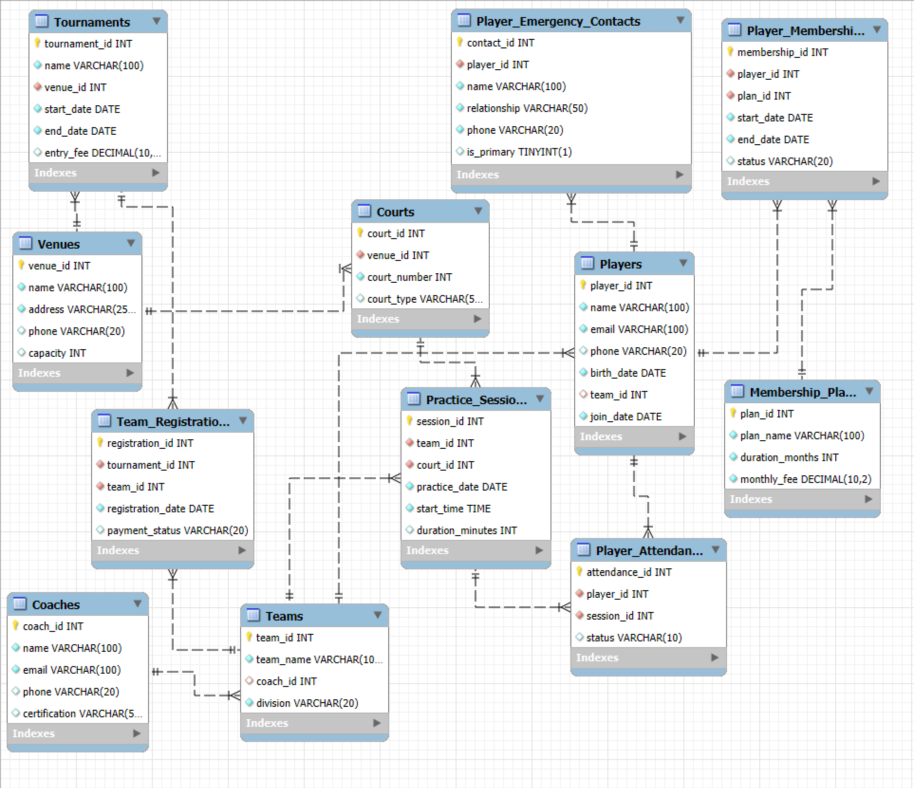

# MIST4610 Group Project 1

## Team Name and Members

### Group 1
- Caleb Sandler (cjs06002@uga.edu)
- Nikita Brahmane (nrb26799@uga.edu)

## Scenario Description

Our client is a volleyball club that manages players, coaches, teams, venues, courts, tournaments, and practices. The club is experiencing rapid growth with over 200 players across junior, high school, and adult divisions. They needed a database to replace their inefficient system of spreadsheets and paper records to track:
- Player team assignments and memberships
- Practice scheduling across multiple venues
- Tournament registrations and payment tracking
- Court bookings and availability
- Emergency contact information for safety compliance

## Data Model



Our data model consists of 10 main entities with relationships that track all aspects of the volleyball club operations. Players belong to teams, which are led by coaches. Teams participate in tournaments, practice on courts within venues, and players maintain membership plans. The model efficiently tracks attendance, emergency contacts, and tournament registrations.

## Data Dictionary

### Table: Players
| Column Name | Description | Data Type | Size | Format | Key? |
|-------------|-------------|-----------|------|--------|------|
| player_id | Unique identifier for each player | INT | - | - | PK |
| name | Player's full name | VARCHAR | 100 | - | - |
| email | Player's email address | VARCHAR | 100 | - | - |
| phone | Player's contact number | VARCHAR | 20 | - | - |
| birth_date | Player's date of birth | DATE | - | YYYY-MM-DD | - |
| team_id | Team the player belongs to | INT | - | - | FK (Teams) |
| join_date | Date player joined the club | DATE | - | YYYY-MM-DD | - |

---

## Table: Coaches
| Column Name | Description | Data Type | Size | Format | Key? |
|-------------|-------------|-----------|------|--------|------|
| coach_id | Unique identifier for each coach | INT | - | - | PK |
| name | Coach's full name | VARCHAR | 100 | - | - |
| email | Coach's email address | VARCHAR | 100 | - | - |
| phone | Coach's contact number | VARCHAR | 20 | - | - |
| certification | Coaching certification details | VARCHAR | 255 | - | - |

---

## Table: Teams
| Column Name | Description | Data Type | Size | Format | Key? |
|-------------|-------------|-----------|------|--------|------|
| team_id | Unique identifier for each team | INT | - | - | PK |
| team_name | Name of the team | VARCHAR | 100 | - | - |
| coach_id | Coach assigned to the team | INT | - | - | FK (Coaches) |
| division | Age group or skill division of the team | VARCHAR | 50 | - | - |

---

## Table: Venues
| Column Name | Description | Data Type | Size | Format | Key? |
|-------------|-------------|-----------|------|--------|------|
| venue_id | Unique identifier for each venue | INT | - | - | PK |
| name | Venue name | VARCHAR | 100 | - | - |
| address | Venue location | VARCHAR | 255 | - | - |
| capacity | Maximum occupancy of the venue | INT | - | - | - |

---

## Table: Courts
| Column Name | Description | Data Type | Size | Format | Key? |
|-------------|-------------|-----------|------|--------|------|
| court_id | Unique identifier for each court | INT | - | - | PK |
| venue_id | Venue where the court is located | INT | - | - | FK (Venues) |
| court_number | Court designation within the venue | INT | - | - | - |

---

## Table: Tournaments
| Column Name | Description | Data Type | Size | Format | Key? |
|-------------|-------------|-----------|------|--------|------|
| tournament_id | Unique identifier for each tournament | INT | - | - | PK |
| name | Tournament name | VARCHAR | 100 | - | - |
| venue_id | Venue where the tournament is hosted | INT | - | - | FK (Venues) |
| dates | Tournament schedule | DATE | - | YYYY-MM-DD | - |

---

## Table: Team_Registrations
| Column Name | Description | Data Type | Size | Format | Key? |
|-------------|-------------|-----------|------|--------|------|
| registration_id | Unique identifier for each registration | INT | - | - | PK |
| tournament_id | Tournament being registered for | INT | - | - | FK (Tournaments) |
| team_id | Team participating in the tournament | INT | - | - | FK (Teams) |
| date | Date of registration | DATE | - | YYYY-MM-DD | - |

---

## Table: Practice_Sessions
| Column Name | Description | Data Type | Size | Format | Key? |
|-------------|-------------|-----------|------|--------|------|
| session_id | Unique identifier for each practice session | INT | - | - | PK |
| team_id | Team attending the practice session | INT | - | - | FK (Teams) |
| court_id | Court assigned for the session | INT | - | - | FK (Courts) |
| date | Date of the practice session | DATE | - | YYYY-MM-DD | - |

---

## Table: Player_Attendance
| Column Name | Description | Data Type | Size | Format | Key? |
|-------------|-------------|-----------|------|--------|------|
| attendance_id | Unique identifier for each attendance record | INT | - | - | PK |
| player_id | Player who attended the session | INT | - | - | FK (Players) |
| session_id | Practice session attended | INT | - | - | FK (Practice_Sessions) |
| status | Attendance status (Present/Absent) | VARCHAR | 10 | - | - |

---

## Table: Membership_Plans
| Column Name | Description | Data Type | Size | Format | Key? |
|-------------|-------------|-----------|------|--------|------|
| plan_id | Unique identifier for each membership plan | INT | - | - | PK |
| name | Membership plan name | VARCHAR | 100 | - | - |
| duration | Duration of the membership (e.g., 3 months, 1 year) | VARCHAR | 50 | - | - |
| fee | Cost of the membership plan | DECIMAL | 10,2 | - | - |

---

## Table: Player_Memberships
| Column Name | Description | Data Type | Size | Format | Key? |
|-------------|-------------|-----------|------|--------|------|
| membership_id | Unique identifier for each player membership | INT | - | - | PK |
| player_id | Player assigned to the membership plan | INT | - | - | FK (Players) |
| plan_id | Membership plan chosen | INT | - | - | FK (Membership_Plans) |
| start_date | Start date of membership | DATE | - | YYYY-MM-DD | - |
| end_date | End date of membership | DATE | - | YYYY-MM-DD | - |

---

## Table: Player_Emergency_Contacts
| Column Name | Description | Data Type | Size | Format | Key? |
|-------------|-------------|-----------|------|--------|------|
| contact_id | Unique identifier for each emergency contact | INT | - | - | PK |
| player_id | Player associated with the contact | INT | - | - | FK (Players) |
| name | Emergency contact name | VARCHAR | 100 | - | - |
| phone | Emergency contact number | VARCHAR | 20 | - | - |
| relationship | Relationship to the player | VARCHAR | 50 | - | - |

## Queries

### Query 1: Player Attendance Analysis

**Description**: Identifies players who have missed practices and calculates their attendance rates.

**Justification**: Helps coaches identify players who need follow-up and monitors team commitment levels. Low attendance may indicate scheduling conflicts or waning interest that could affect team performance.

```sql
SELECT p.player_id,
    p.name AS player_name,
    t.team_name,
    c.name AS coach_name,
    COUNT(pa.attendance_id) AS total_practices,
    SUM(CASE WHEN pa.status = 'Present' THEN 1 ELSE 0 END) AS practices_attended,
    ROUND((SUM(CASE WHEN pa.status = 'Present' THEN 1 ELSE 0 END) / COUNT(pa.attendance_id)) * 100, 2) AS attendance_percentage
FROM Players p
JOIN Teams t ON p.team_id = t.team_id
JOIN Coaches c ON t.coach_id = c.coach_id
JOIN Player_Attendance pa ON p.player_id = pa.player_id
GROUP BY p.player_id, p.name, t.team_name, c.name
HAVING SUM(CASE WHEN pa.status = 'Absent' THEN 1 ELSE 0 END) > 0
ORDER BY attendance_percentage ASC;
```
---
### Query 2: Tournament Revenue Analysis by Venue

**Description**: Analyzes tournament hosting, team participation, and revenue generation by venue.

**Justification**: Helps management evaluate venue profitability for tournaments. Identifies venues with better registration and payment completion rates to optimize future tournament planning.

```sql
SELECT v.venue_id,
    v.name AS venue_name,
    v.capacity,
    COUNT(DISTINCT t.tournament_id) AS total_tournaments,
    COUNT(tr.registration_id) AS total_team_registrations,
    SUM(t.entry_fee) AS total_potential_revenue,
    SUM(CASE WHEN tr.payment_status = 'Paid' THEN t.entry_fee ELSE 0 END) AS actual_revenue,
    ROUND((SUM(CASE WHEN tr.payment_status = 'Paid' THEN t.entry_fee ELSE 0 END) / SUM(t.entry_fee)) * 100, 2) AS payment_rate,
    (SELECT COUNT(*) FROM Tournaments WHERE venue_id = v.venue_id AND start_date > CURDATE()) AS upcoming_tournaments
FROM Venues v
JOIN Tournaments t ON v.venue_id = t.venue_id
JOIN Team_Registrations tr ON t.tournament_id = tr.tournament_id
GROUP BY v.venue_id, v.name, v.capacity
ORDER BY total_potential_revenue DESC;
```
---
### Query 3: The Most Active Teams Based on Tournament Participation

**Description**: Analyzes the performance and revenue generation of volleyball teams that participated in multiple tournaments during the year 2023. 

**Justification**: The query provides valuable insights into which teams are the most active and financially impactful for the volleyball club. Teams that participate in more tournaments and pay higher entry fees contribute significantly to the club's revenue stream. By identifying these high-performing teams, the club can focus on maintaining strong relationships with them, potentially offering incentives or rewards to keep them engaged.

```sql
SELECT 
    t.team_id,
    t.team_name,
    COUNT(tr.tournament_id) AS total_tournaments_participated,
    SUM(tn.entry_fee) AS total_revenue_generated,
    AVG(tn.entry_fee) AS average_entry_fee
FROM Teams t
JOIN Team_Registrations tr ON t.team_id = tr.team_id
JOIN Tournaments tn ON tr.tournament_id = tn.tournament_id
WHERE 
    tn.start_date >= '2023-01-01' 
    AND tn.end_date <= '2023-12-31'
    AND tr.payment_status = 'Paid'
GROUP BY t.team_id, t.team_name
HAVING COUNT(tr.tournament_id) >= 2 AND AVG(tn.entry_fee) > 30
ORDER BY total_revenue_generated DESC;
```
---
### Query 4: Tracking Tournament Participation and Entry Fees 

**Description**: Analysis of the revenue generate from tournament entry fees for teams that are highly active in participating in tournaments.

**Justification**: The club can use the total revenue generated to evaluate the success of tournaments and decide whether to host more or adjust entry fees. Also, knowing which teams are most active helps the club allocate resources (e.g., court time, coaching staff) more effectively.

```sql
SELECT 
    t.team_id,
    t.team_name,
    COUNT(tr.tournament_id) AS total_tournaments_participated,
    SUM(tour.entry_fee) AS total_revenue_generated,
    AVG(tour.entry_fee) AS average_entry_fee_per_tournament
FROM 
    Teams t
JOIN Team_Registrations tr ON t.team_id = tr.team_id
JOIN Tournaments tour ON tr.tournament_id = tour.tournament_id
WHERE tr.payment_status = 'Paid'
GROUP BY t.team_id, t.team_name
HAVING COUNT(tr.tournament_id) > 1
ORDER BY total_revenue_generated DESC;
```

[Add remaining queries in same format]

## Matrix of Query Features

| SQL Feature | Q1 | Q2 | Q3 | Q4 | Q5 | Q6 | Q7 | Q8 | Q9 | Q10 |
|-------------|----|----|----|----|----|----|----|----|----|----|
| Multiple table join | ✓ | ✓ | ✓ | ✓ |    |    |    |    |    |    |
| Subquery |    | ✓ | ✓ | ✓ |    |    |    |    |    |    |
| GROUP BY | ✓ | ✓ | ✓ | ✓ |    |    |    |    |    |    |
| GROUP BY with HAVING | ✓ |    | ✓ | ✓ |    |    |    |    |    |    |
| Aggregate function | ✓ | ✓ | ✓ | ✓ |    |    |    |    |    |    |
| CASE statement | ✓ | ✓ |    |    |    |    |    |    |    |    |
| Multi-condition WHERE |    |    |    | ✓ |    |    |    |    |    |    |
| Built-in functions | ✓ | ✓ |    |    |    |    |    |    |    |    |
| Calculated field | ✓ | ✓ | ✓ | ✓ |    |    |    |    |    |    |
